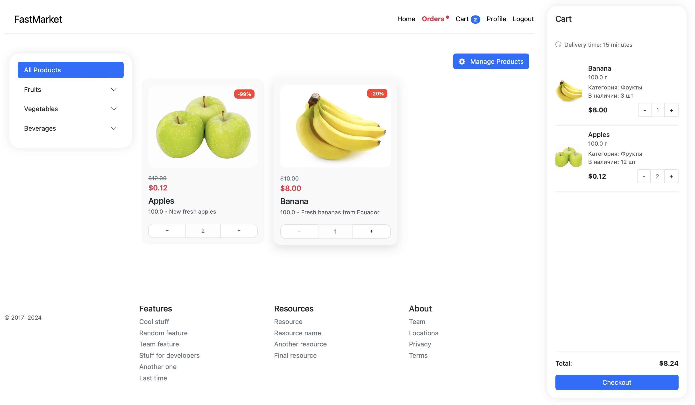
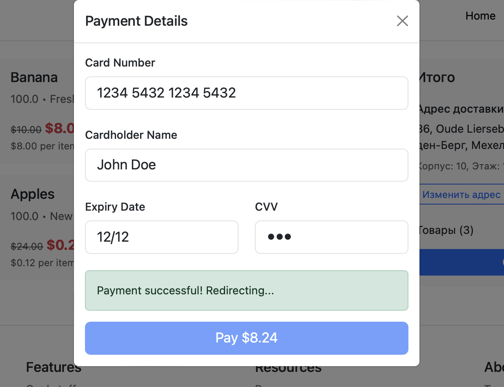

# 🛍️ Application Usage Examples

## Main Page with Cart

On the main page, users can browse available products and add them to their cart. 🛒 The user-friendly interface allows for easy management of product quantities and viewing the total order amount.

## Payment Page

On the payment page, users can enter their details to complete the purchase. 💳 The application ensures secure payment processing and protection of personal information.

## Application Features

- 📱 **Responsive Design**: The application looks great on both mobile devices and desktops.
- 🖼️ **Image Upload**: Users can upload images for products.
- 🔐 **Secure Payment Processing**: All transactions are secure and protected.

## Conclusion

This application provides users with a convenient and secure way to shop online. We are continuously working on improving functionality and user experience. 🚀